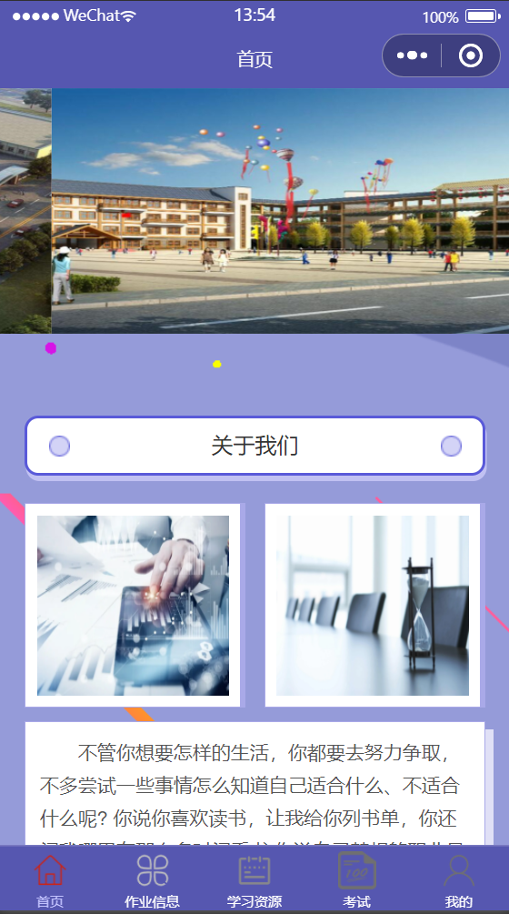
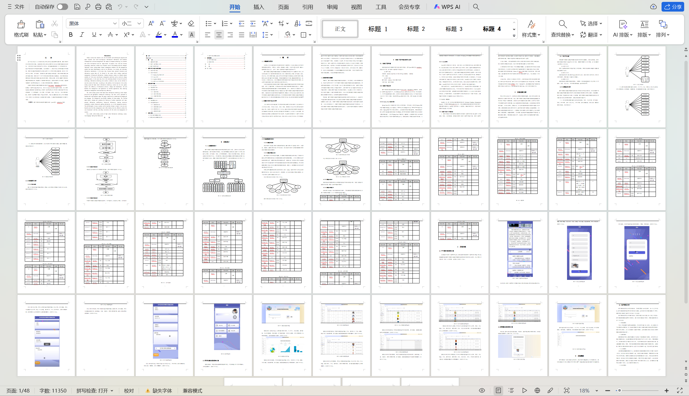

# mpweixinA055
mpweixinA055信息技术课程测试微信小程序LW+PPT
 
## 查看主页获取源码

### 一、关键词
信息技术课测试，信息技术课程考核，信息技术在线测试微信小程序

### 二、作品包含
源码+数据库+万字设计文档+PPT+全套环境和工具资源+本地部署教程

### 三、项目技术
前端技术： Html、Css、Js、Vue2.0、Element-ui、uniapp
后端技术：Java、SpringBoot2.0、MyBatis

### 四、运行环境（以下版本亲测，其他版本兼容性请自行测试）
开发工具：IDEA/eclipse  + VSCODE + 微信开发者工具 + HBuilder X

数据库：MySQL5.7

数据库管理工具：Navicat10以上版本

环境配置软件： JDK1.8 + Maven3.6.3

前端Nodejs：14

浏览器：谷歌浏览器

### 五、项目介绍
项目编号：mpweixinA055

该高中信息技术课程在线测试系统采用Uni-weixin、SpringBoot架构等技术，前端以小程序页面呈现给学生，结合后台java语言使页面更加完善，后台使用MySQL数据库进行数据存储。该微信小程序主要设计并完成了管理过程中的学生注册登录、个人信息修改、作业信息、学习资源、考试、学生作业、评分信息等功能。该微信小程序操作简便，界面设计简洁，不但可以基本满足本行业的日常管理工作，同时又可以有效减少人员成本和时间成本，为课程在线测试管理工作提供了方便。
  

### 六、运行截图

